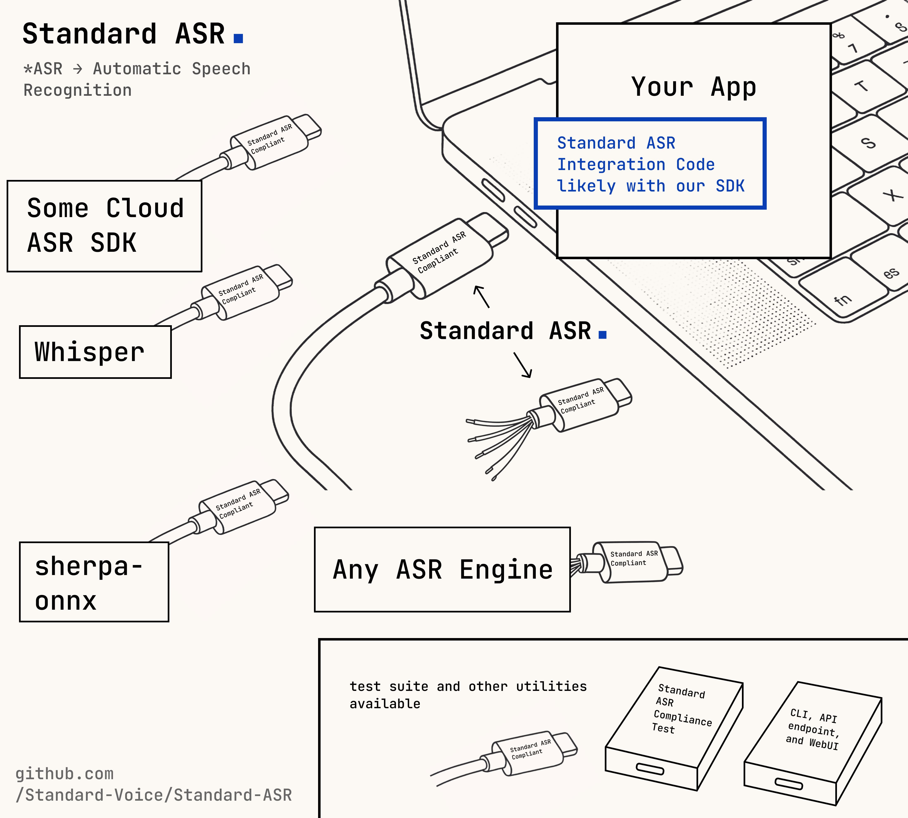

# Standard ASR

[](https://microsoft.github.io/pyright/)
[](https://standard-voice.zulipchat.com)


> ⚠️⚠️⚠️ Standard ASR is still work in progress!! Breaking changes may be introduced at any moment!!
> 
> For production use, please wait until `v1.0.0` release, where we will be stabilizing the APIs and enforce migration policy when breaking changes do happen. We strictly follow semantic versioning.
>
> Please test out standard library and give us feedback or your opinion. Let's shape the future of ASR library together!




## Introduction
Standard ASR (Automatic Speech Recognition) is a protocol that attempts to standardize the way to interact with different ASR models. 

Think of this as the USB-C for speech recognition libraries. We help standardize how the users of ASR libraries interact with ASR libraries, so application developers can use one code to interact with different ASR packages and models.

ASR integration code should be written once and only once. Application developers should not be writing new code when new ASR packages got released. One code should work with any ASR models, because they all do one thing: transcribe audio into text.

That's what we tries to do: the usb protocol for ASR libraries.

## Entrypoint Quickstart

Standard ASR discovers compliant plugins through the ``standard_asr.models``
entrypoint group. Each plugin exposes one or more model presets using keys like
``<engine_id>/<model_name>``. A tiny demo plugin ships in ``cookbook/std_dummy_asr``
so you can try the workflow without extra dependencies:

```bash
uv run uv pip install -e cookbook/std_dummy_asr
uv run standard-asr models list
uv run standard-asr compliance entrypoints
uv run python cookbook/sample_client.py
```

The sample client will discover the installed model, instantiate it, and print a
synthetic transcript. Use this flow as a template when building your own plugin.


---


- Strictly follows semantic versioning
- Pydantic v2 to model ASR's settings
- Fully async support
- pytest (strict mode passed)
- use logging


# A: 核心目标:
- A.1: 做 ASR 推理领域的 usb 标准: 提供通用的接口，让 ASR 推理开发者，ASR 使用者，能有一个共同的标准，互相沟通。
- A.2: 提供测试套件和周边工具，让 ASR 库开发者更好的开发好用，稳健，工程化的库
- A.3: 适配过 Standard ASR 标准的代码，应该可以免配置直接跑任何 Standard ASR compliant 的模型。如果有额外配置项，需要用 pydantic 暴露出去，让 WebUI 和 GUI 和数据库能动态生成配置。


---

# Faq

> But why do we need to support different ASR engines in our application? Why not just support whisper?

- Different language have different SOTA ASR models. Whisper may be strong in some language and not in others.
- GPU acceleration support varies across platforms.
- AI world evolves fast... SOTA will be refreshed.

With Standard ASR, write once, forget about it. Countless ASR engines are automatically supported.

# Contribution
Please review `CONTRIBUTING.md` file before you make your contribution.

# Communication
We use **Zulip** for development communication:
- https://standard-voice.zulipchat.com

# License

This project is licensed under the Apache 2.0 License. Please checkout [LICENSE](./LICENSE) for more details.
