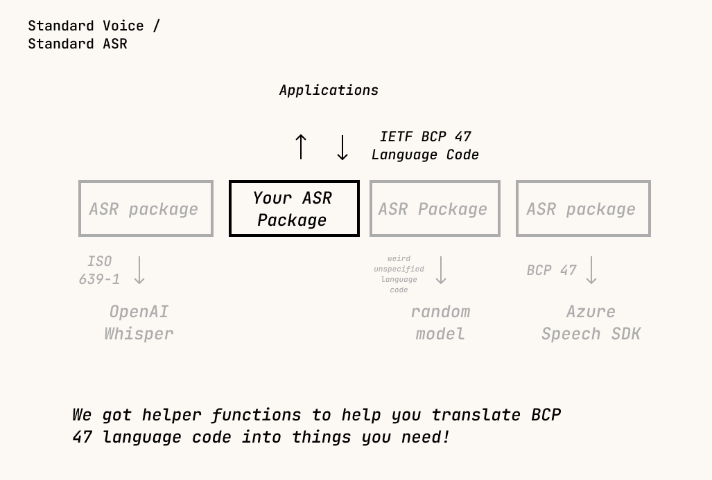

All ASR Engines *MUST* declare properties.

There are some required fields you must declare in properties filed:

- language

## language

Language code must follow **IETF BCP 47 standard**. If your ASR engine requires different language code, use conversion helpers to convert the language code from IETF BCP 47 standard into your standard (eg. ISO 639-1).

### Why not ISO 639-1?
Most of the ASR models are trained with ISO 639-1. However, there are some ASR models accept different format of language code that includes information impossible to represent in ISO 639-1. BCP 47 is a much wider standard, so translation from BCP 47 into different language code is easy, and not vice versa.

