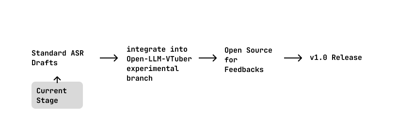

## Draft Stage
> draft stage 要完成一个 MVP，之后拿到 OLV 测试

[ ] working prototype
- [ ] 完整的核心
    - [ ] Properties 设计
    - [ ] Config 设计
    - [ ] 

- 文档
    - 开发人员协作
    - branch 规划
    - 贡献指南
    - quick start 之类的
- 社区规划
    - 论坛 (async discussion)
    - 即时交流软件 (discord? zulip?)
- actions
    - linters
    - type checkers
    - changelog
    - auto-publish
    - testing (多版本)
    - auto-release
- cookbook
    - 应用开发者如何使用 std asr compliant 的 asr
    - ASR 开发者如何开发 std asr compliant 的 asr
- 最后做视频介绍

